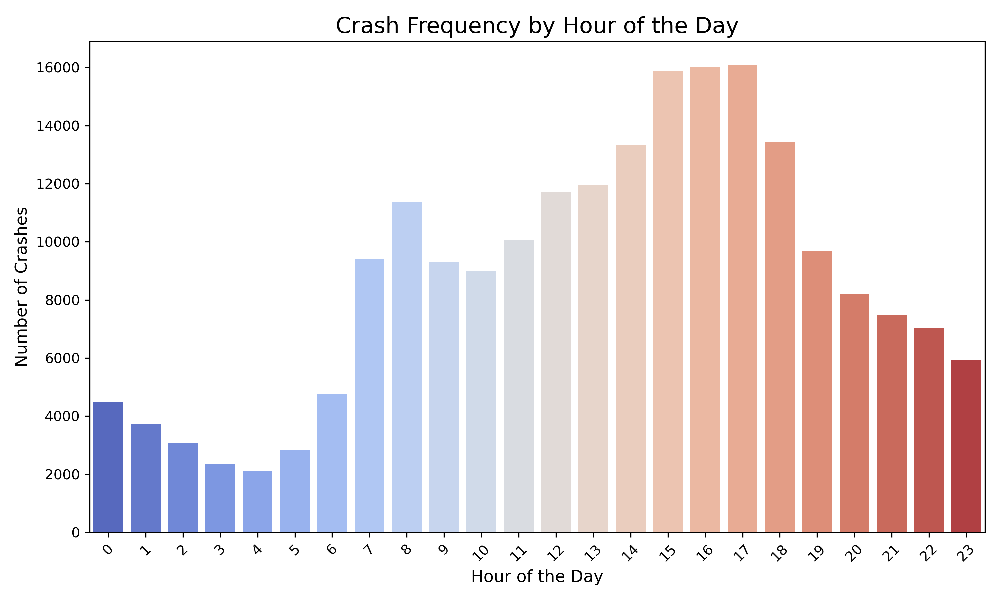
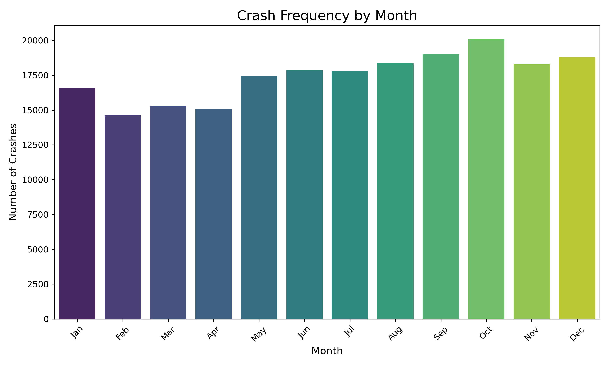
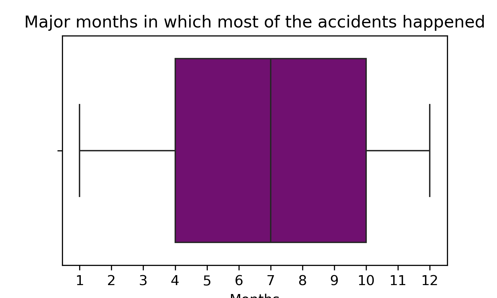
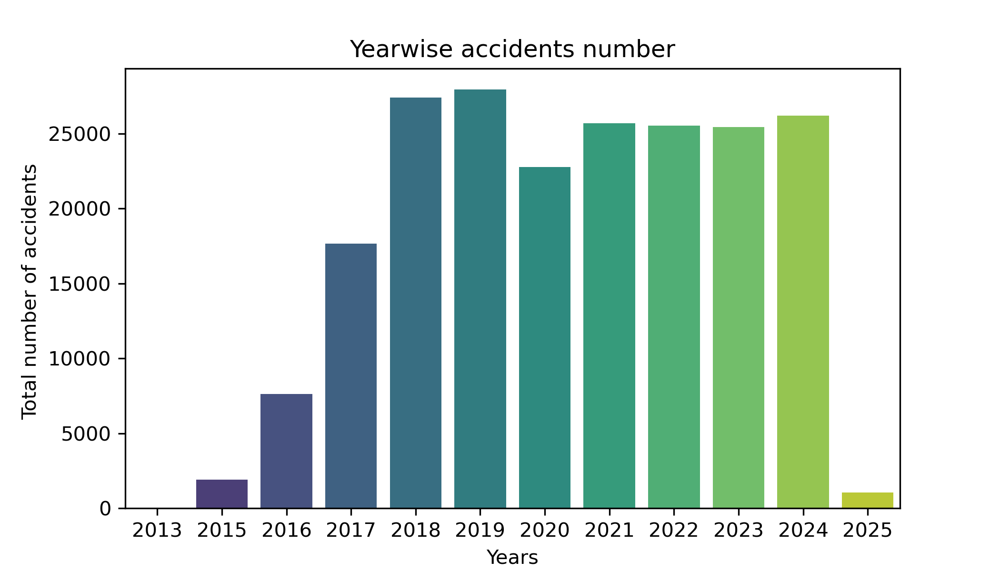
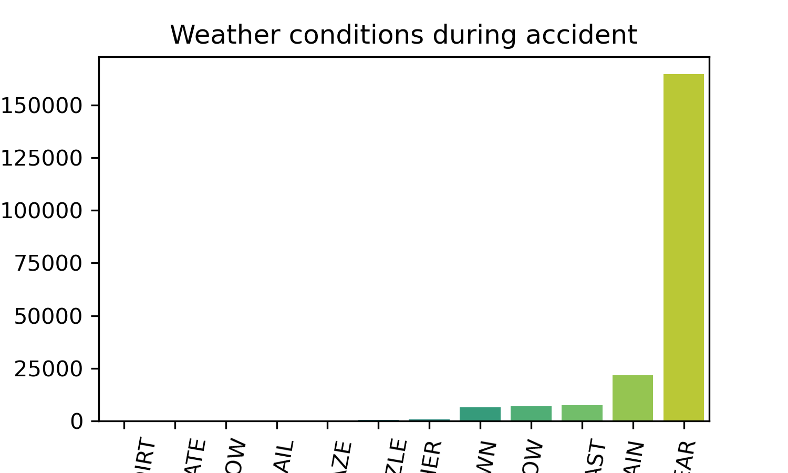

# Road Accident Analysis Report

---

## **Introduction**
Welcome to the world of data-driven insights, where we unravel the story hidden in numbers. This report dives into the crash dataset to uncover the factors contributing to road accidents, from the influence of weather to the time of day. Buckle up as we navigate through the twists and turns of data analysis to identify patterns and trends that can save lives.

---

## **Data Overview**
The dataset contains information on road accidents, including:
- **Crash Date & Time**: When the accidents occurred (year, month, day, hour).
- **Environmental Factors**: Weather, lighting, and roadway conditions.
- **Crash Details**: Types of crashes, contributing causes, and location-related factors (e.g., intersections).
- **Impact**: Total injuries, fatalities, and severity levels (e.g., incapacitating vs. non-incapacitating).

Let’s visualize and analyze this data to uncover what’s behind the wheel of these accidents.

---

## **Key Findings**

### **1. When Do Most Crashes Occur?**
**Insight**: Crashes spike during **evening rush hours** (5-8 PM) and in the winter months (December-January). Darkness and high traffic volumes are likely contributors.

### **2. Weather Woes**
**Insight**: Unsurprisingly, adverse weather conditions (like rain and snow) increase the likelihood of accidents. Clear weather accounts for most crashes but mainly due to higher traffic exposure during these times.

**Pro Tip**: Rainy days? Slow it down and stay extra cautious.

### **3. Dangerous Lighting Conditions**
**Insight**: Poor lighting (dusk, dawn, or dark with no streetlights) correlates strongly with severe accidents, especially fatal ones. Proper lighting could be a lifesaver here.

### **4. Top Crash Causes**
The most common culprits:
1. **Distracted Driving** (e.g., texting while driving)
2. **Speeding**
3. **Failure to Yield Right of Way**

**Call to Action**: A campaign to educate drivers on these causes could reduce crashes significantly.

### **5. Crash Severity**
- **Fatal Crashes**: Most frequent in high-speed zones and poor road conditions.
- **Non-Incapacitating Injuries**: Often linked to wet roads and intersections.

---

## **Visualization Highlights**

### **Crash Trends Over Time**
- A **year-over-year increase** in crashes suggests the need for proactive road safety measures.
  

### **Injury Distribution**
- Most injuries occur on clear-weather days, though severity increases in adverse conditions.

### **Geospatial Analysis (If Location Data is Available)**
Heatmaps show **hotspots** for crashes—often near busy intersections or poorly maintained roads.

---

## **Recommendations**
1. **Install Better Street Lighting**: Especially in high-risk zones.
2. **Promote Safe Driving Campaigns**: Address distractions and speed-related causes.
3. **Weather-Specific Warnings**: Implement real-time warnings for adverse weather.
4. **Improve Road Maintenance**: Prioritize fixing potholes and improving signage at intersections.
5. **Data-Driven Enforcement**: Deploy more police patrols during peak crash times.

---

## **Conclusion**
Road safety isn’t just about building better roads; it’s about understanding when and why accidents occur. This analysis sheds light on actionable insights that can guide policymakers, engineers, and drivers alike. Let’s use this data to pave the way for safer roads and fewer crashes.

---

**P.S.** Data doesn’t lie—but it’ll steer you right if you’re ready to listen. Drive safe!

